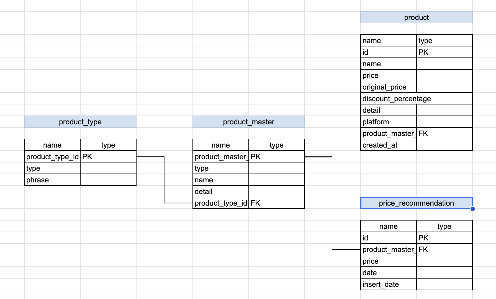

# web-scraping
This repo will give you a reference about how to scrap information from ecommerce website.

## Guidance

1. Put required environment variable on `.env` file.
2. Run the code by `docker compose up -d` on the terminal.
3. Scheduled code will scrape the web at 01:00 o'clock or 19:00 UTC time.
4. Web scraping status can be monitored on monitor.log.
5. Price recommendation endpoint can be tested on `http://{host}:9090/api/doc`.
6. Price is recomended for the next 7 days based on previous 7 days data.

## Data Relation

Data relation of this project is described as follows.

Detail of data can be found on `initialize_db.py`.

## Next Development

1. Add new source to be included in the ecommerce list.
2. Add update feature on api to update product master and type.
3. Cover product with various units other than ML, L, KG and G.
4. Improve price recommendation using time series approach.
4. Add cloud deployment code using terraform.